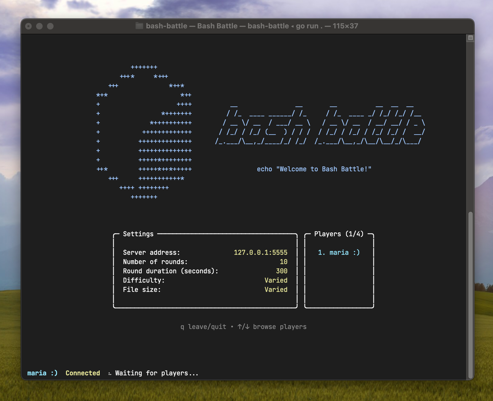

# Bash Battle

Bash Battle is a competitive problem-solving game for those who want to learn or practice Bash. It's designed for multiplayer play over a local network, but it can certainly be played solo as well. Oh and, the game runs entirely in the terminal!

This repo contains the TUI application for Bash Battle.

Here is what the starting screen, or lobby, looks like. (This is currently the only screen.)

> [!NOTE]
> _The project is very much under development!_ There is still a lot left to do. I'm working on the gameplay aspect next.

## Getting Started

TODO (once more is done)

## Motivation

I wanted a fun environment to practice Bash, specifically file and text processing commands, with real examples. I was also looking for an opportunity to build a TUI with the fantastic [Bubble Tea](https://github.com/charmbracelet/bubbletea) framework. A TUI seemed like the perfect match, and so I began this project!

This project has allowed me to:
- Practice writing Go, a new language for me
- Apply client-server architecture concepts
- Try out gRPC

## Technology

- **Language**: Go
- **TUI**: [Charm](https://github.com/charmbracelet) stack
- **Networking**: Protocol Buffers, gRPC

There are two other repos related to this project.

- [bash-battle-proto](https://github.com/maria-mz/bash-battle-proto/tree/main): Go package defining the gRPC messaging protocol for Bash Battle
- [bash-battle-server](https://github.com/maria-mz/bash-battle-server/tree/main): Server for running Bash Battle games
